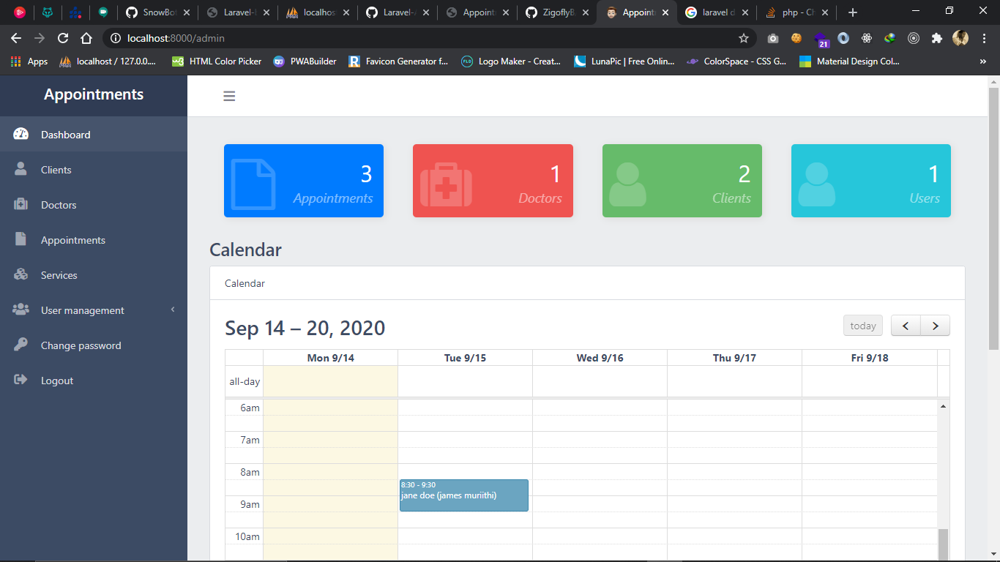
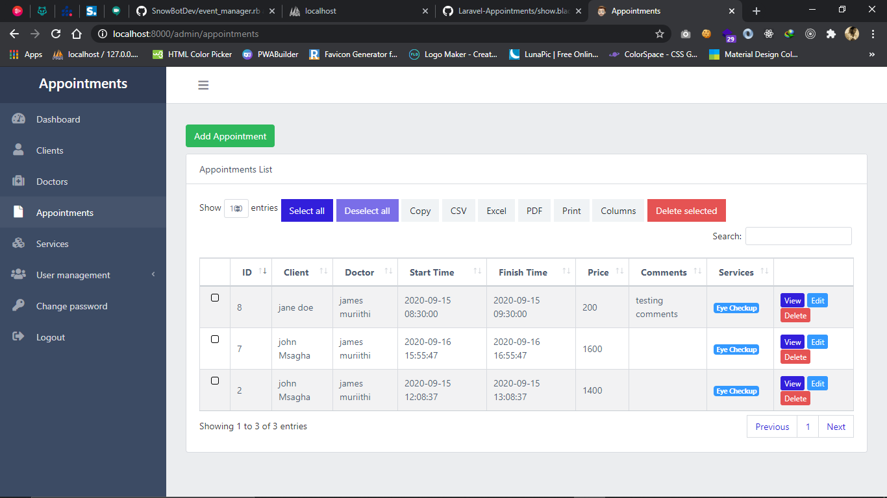

# Laravel Appointments System

Simple project to manage appointments for an hospital.
It manage your Services, Doctors, Clients and Appointments, viewing them in a calendar.

## Screenshots

---

System is partly generated with [QuickAdminPanel](https://2019.quickadminpanel.com), with some tweaks afterwards.

Other assets used:

- [CoreUI Free theme](https://coreui.io/demo/#main.html) (Bootstrap 4)
- [FullCalendar library](https://fullcalendar.io/) (version 3)

---

## How to use

- Clone the repository with __git clone__
- Copy __.env.example__ file to __.env__ and edit database credentials there
- Run __composer install__
- Run __php artisan key:generate__
- Run __php artisan migrate --seed__ (it has some seeded data for your testing)
- That's it: launch the main URL (http://localhost:8000/). 
- You can login to adminpanel with default credentials __admin@admin.com__ - __password__

## License

Basically, feel free to use and re-use any way you want.

---